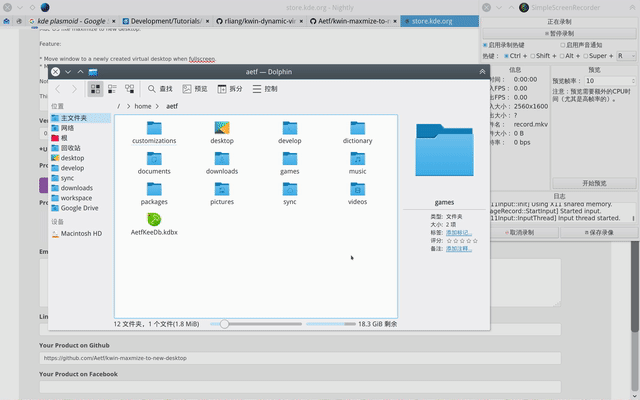
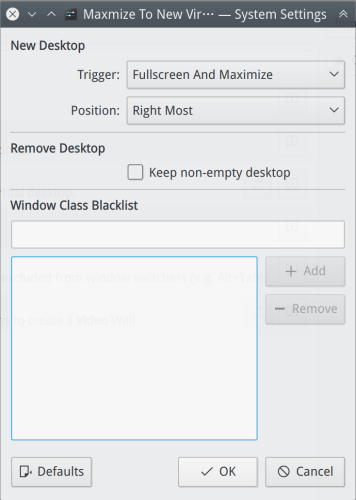

# kwin-maxmize-to-new-desktop

KWin script that moves fullscreened window to a new virtual desktop, emulating macOS like maximize to new desktop.

[Link to KDE Store page][store].

## Screenshot



The config panel



## Feature

* Move window to a newly created virtual desktop when fullscreen/maximize.
* Move window back to original desktop when restored to normal size or closed.
* Configurable trigger: `fullscreen` or `maximize` or `both`.
* Configurable new desktop position: `right most` or `next to current desktop` or `next to app`.
* Window blacklist: windows that match the class name will not trigger the script.

__Note__:
The default behavior is triggered by window **FULLSCREEN**, not the normal maximize. Window fullscreen can be enabled by right clicking on the window decoration -> `More Actions` -> `Fullscreen`.

Web browsers also enters fullscreen mode when the web page requests so, like clicking on fullscreen button in videos. In Firefox or Chrome, pressing `F11` also triggeres this.

## Installation

### Install via Get New Scripts (Recommended)

Go to `System Settings` -> `Window Management` -> `KWin Scripts` -> `Get New Scripts...`

And then search for `kwin-maximize-to-new-desktop`.

Note: __To get the configuration panel fully working, see [this](#no-configuration-button-available-in-the-kwin-scripts-entry)
and [this](#blank-window-class-blacklist-in-configuration)__

### Install directly

Download the latest release from KDE [store][store], and run

```bash
plasmapkg2 --install kwin-maxmize-to-new-desktop-0.2.0.tar.gz
```

Note: __To get the configuration panel fully working, see [this](#no-configuration-button-available-in-the-kwin-scripts-entry)
and [this](#window-class-blacklist-in-configuration-is-blank)__

## Tips

### Get window's class for the blacklist

Right click on the window decoration of the window of interest, then select
`More actions` -> `Special Window Settings` in the menu. In the "Window matching"
tab, there's a little utility called "Detect Window Properties" that can be used to reveal information of clicked window.

## Trouble Shooting

### No configuration button available in the KWin Scripts entry

Due to a technical limitation of installation, the desktop file is not installed into correct place. More details [here](https://github.com/faho/kwin-tiling/issues/79#issuecomment-311465357).

```bash
mkdir -p ~/.local/share/kservices5
ln -s ~/.local/share/kwin/scripts/max2NewVirtualDesktop/metadata.desktop ~/.local/share/kservices5/max2NewVirtualDesktop.desktop
```

### Blank window class blacklist in configuration

You need to install an additional package called `kdesignerplugin` ([link](https://github.com/KDE/kdesignerplugin)),
which makes it possible to use KEditListWidget.

* For ArchLinux: `pacman -Syu kdesignerplugin`.
* For Ubuntu and alike: `apt install kdesignerplugin`.

### Configuration not picked up by the script after changing

Log out and log in again.

Or you could try something like the following to restart kwin (the executable name may be different depending on your Linux distribution.)

```bash
kwin_x11 --replace >/dev/null 2>/dev/null &; disown
```

### ~~KWin hangs or crashes after a fullscreened/maximized window is directly closed~~

Fixed in efc212cbc38b8f5d10a30d28a034e21288519ea4.

The root cause is the clientRemoved signal I connected to is too late and only emits after
cleanGrouping called on the client. Moving the client around and changing focus requires a not null
group of the client in kwin. Therefore, changing to per window windowClosed signal works.

## Change Log

See [CHANGELOG.md](CHANGELOG.md).

## Thanks

* I got the idea of triggering by maximize and other things from one of the [fork](https://github.com/lrasche/kwin-maximize-to-new-desktop) by @lrasche.
* I also learned a lot about adding configuration UI from [faho/kwin-tiling](https://github.com/faho/kwin-tiling).

[store]: https://store.kde.org/p/1171196/
